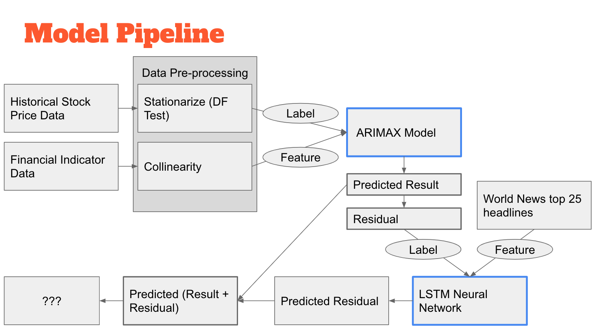
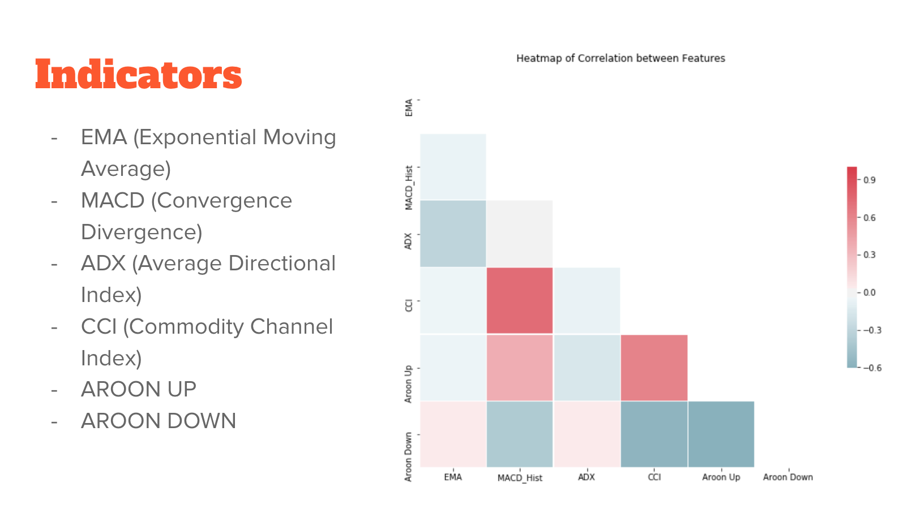
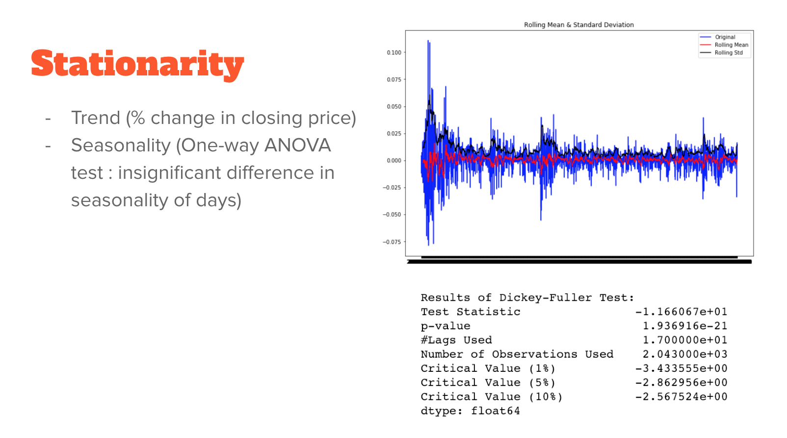
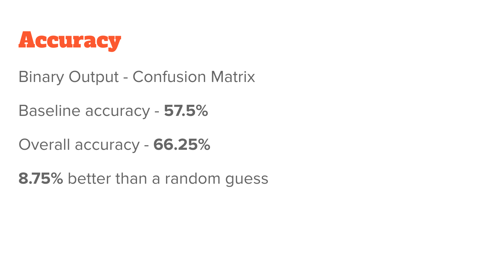

# Stock Prediction

## Goal
Predict direction of percentage change in daily price of Dow Jones Industrial Average

### Data
- Closing price
- Financial indicators
- World news

## Model Pipeline

## Exogenous Variables

## Stationarity

## Model Accuracy

## Ensemble

- Top 25 daily headlines for world news (source: Reddit)
- Tokenized, sequenced into embedding layer
- Predict residual (predicted - actual) of first model's output using LSTM Recurrent Neural Network Model
- RMSE of first model residual = 0.085
- RMSE of second model (output + closing price % change) = 0.07

## Further Improvements
- Better text data and model to achieve more significant results
- ARIMA model works with past data, plan to add more variables that capture future market price
